<h2>Partie Backend</h2>
<h3>-Architecture Backend de l'application</h3>
<li>Couche DAO : Contient les interfaces JPA Repository basées sur Spring Data</li>
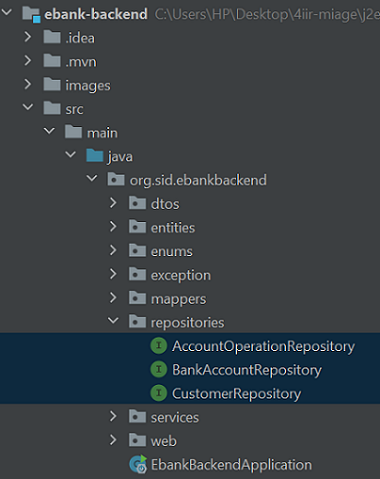
<li>Entités JPA: Customer, BankAccount, Saving Account, CurrentAccount, AccountOperation </li>
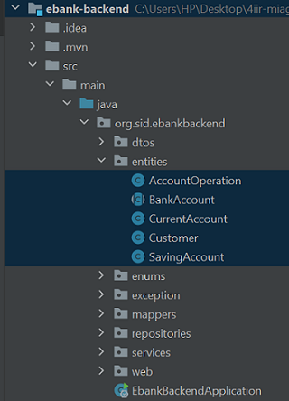
<li>DTOS </li>
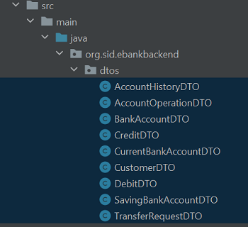
<li>Couche service</li>
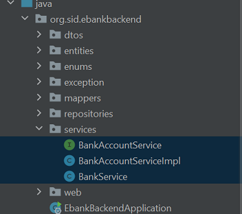
<li>RestController</li>
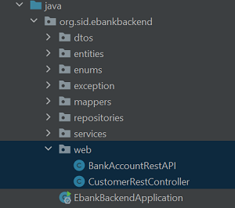
<li>Les exceptions : BalanceNotException, BankAccountNotFoundException, CustomerNotFoundException</li>
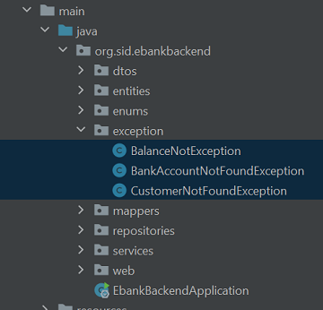
<h3>-Couche service, web</h3>
<h4>BankAccountService & BankAccountServiceImpl</h4>
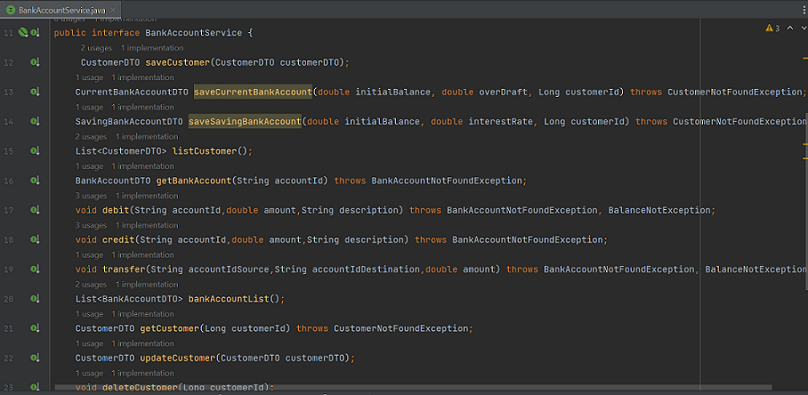
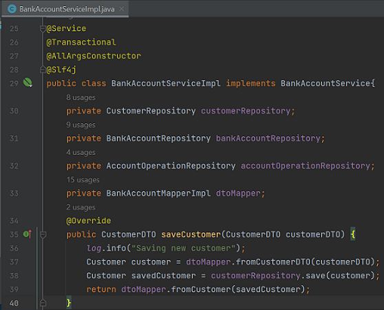    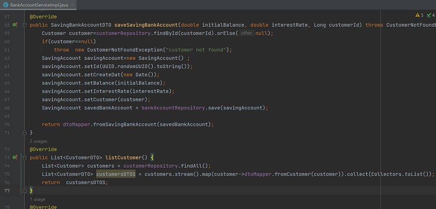
<h4>Couche web</h4>
<li>CustomerRestController</li>
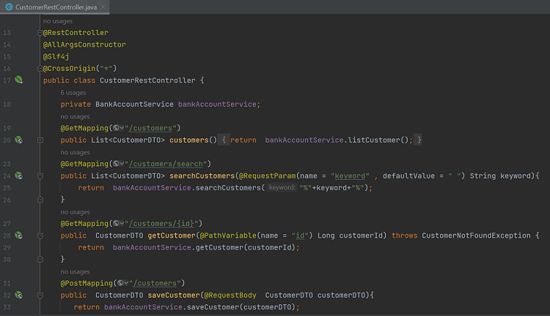
<li>BankAccountRestApi</li>
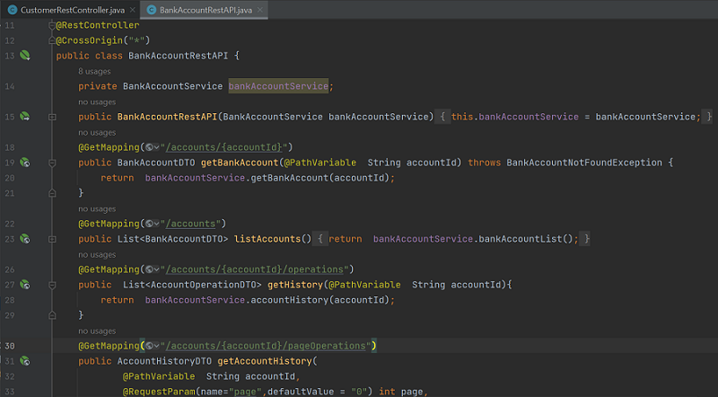
<h4>Test de la couche web (Swagger UI)</h4>
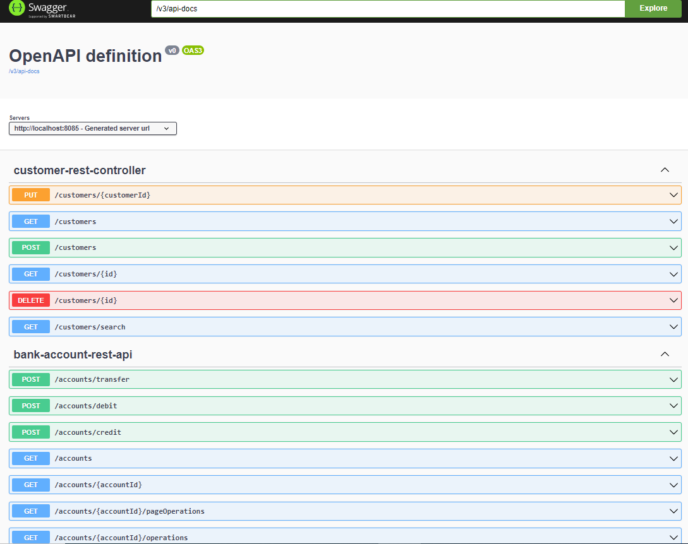
<li>Ajouter un client</li>
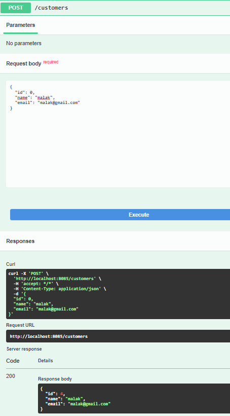
<li>La liste des clients</li>
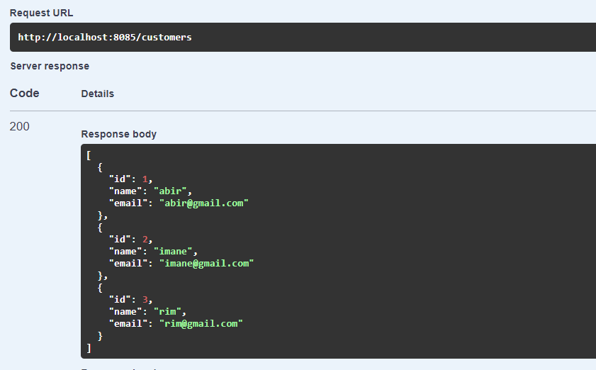
<li>Rechercher un client par son Id</li>
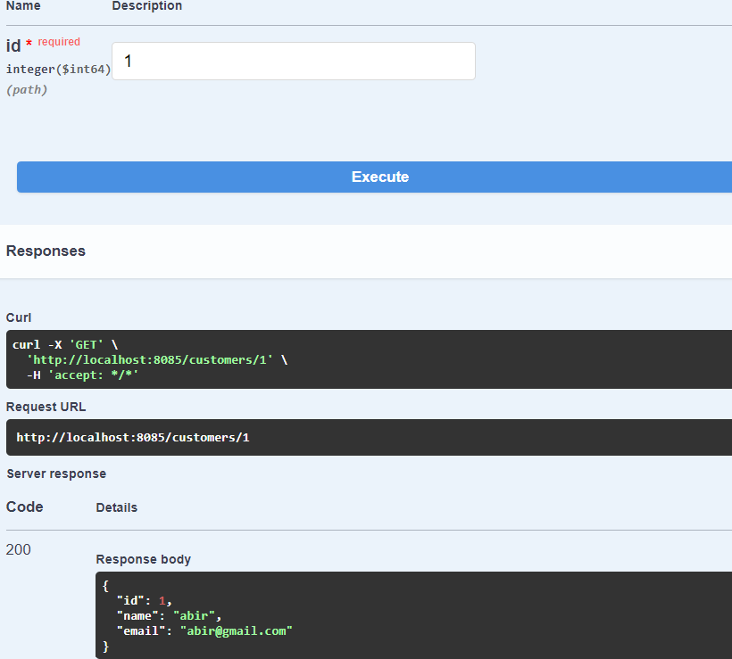
<li>La listes des comptes</li>
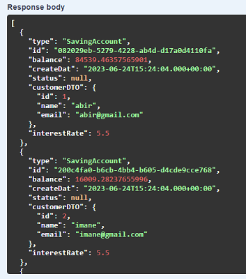
<li>La listes des operations d'un compte</li>
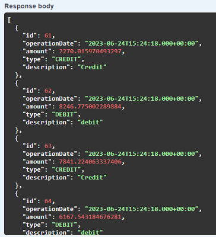
